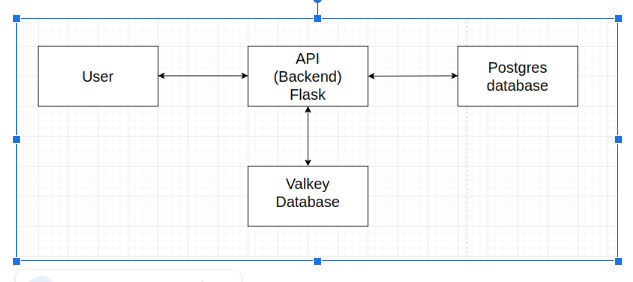
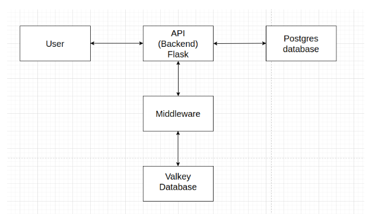

# Approach Paper - Employee Information Management System

## Table of Contents
1. [Objective](#1-objective)
2. [Proposed Solutions](#2-proposed-solutions)
3. [Approach 1: Direct Flask-Valkey Integration](#3-approach-1-direct-flask-valkey-integration)
   - 3.1. [Architecture Diagram](#31-architecture-diagram)
   - 3.2. [Description](#32-description)
     - Pros
     - Cons
   - 3.3. [Pre-requisites](#33-pre-requisites)
     - 3.3.1. [Hardware Requirements](#331-hardware-requirements)
     - 3.3.2. [Software Requirements](#332-software-requirements)
     - 3.3.3. [Networking Requirements](#333-networking-requirements)
4. [Approach 2: Flask with Middleware for Valkey](#4-approach-2-flask-with-middleware-for-valkey)
   - 4.1. [Architecture Diagram](#41-architecture-diagram)
   - 4.2. [Description](#42-description)
     - Pros
     - Cons
   - 4.3. [Pre-requisites](#43-pre-requisites)
     - 4.3.1. [Hardware Requirements](#431-hardware-requirements)
     - 4.3.2. [Software Requirements](#432-software-requirements)
     - 4.3.3. [Networking Requirements](#433-networking-requirements)
5. [Chosen Approach: Approach 1](#chosen-approach-approach-1)

---

## 1. Objective

The objective of this project is to design a secure and efficient employee information management system that ensures no duplicate employee records exist in the database. The system utilizes Flask as the backend, PostgreSQL for persistent storage, and Valkey as a key-value store to check for duplicate entries before committing data to the database. Valkey is used because it is an in-memory database, which allows faster data retrieval and validation compared to PostgreSQL. The entire setup runs using Podman and Docker containers to ensure portability and ease of deployment.

---

## 2. Proposed Solutions

Two approaches are considered for implementing the employee information system:
- **Approach 1:** Flask backend directly interacts with Valkey for duplicate checking before storing data in PostgreSQL.
- **Approach 2:** A middleware layer is introduced between Flask and Valkey to handle key-value checks more efficiently and asynchronously.

---

## 3. Approach 1: Direct Flask-Valkey Integration

### 3.1. Architecture Diagram

### 3.2. Description

This approach involves direct communication between Flask, Valkey, and PostgreSQL. When a new employee record is submitted:
- Flask checks if the Employee ID exists in Valkey.
- If the ID exists, an error is returned.
- If the ID does not exist, the record is stored in PostgreSQL, and Valkey is updated.

#### Pros:
- Simple and efficient architecture.
- Minimal additional components reduce system complexity.
- Faster validation as Flask directly communicates with Valkey.

#### Cons:
- Increased load on Flask as it handles validation directly.
- Lack of asynchronous processing might cause delays in high-traffic scenarios.

### 3.3. Pre-requisites

#### 3.3.1. Hardware Requirements
- Minimum 4-core CPU, 8GB RAM for development
- For production, a scalable cloud-based infrastructure is recommended

#### 3.3.2. Software Requirements
- OS: Ubuntu 20.04+
- Backend: Flask (Python 3.8+)
- Database: PostgreSQL 14+
- Key-Value Store: Valkey
- Containerization: Podman & Docker

#### 3.3.3. Networking Requirements
- Localhost or internal network communication between containers
- External API access if deployed on the cloud

---

## 4. Approach 2: Flask with Middleware for Valkey

### 4.1. Architecture Diagram

### 4.2. Description

This approach introduces a middleware layer that handles the validation logic before interacting with PostgreSQL. The middleware runs separately, ensuring efficient key-value checks asynchronously.

#### Pros:
- Offloads duplicate checking from Flask, reducing its processing load.
- Asynchronous processing improves system performance under high load.

#### Cons:
- Additional service increases system complexity.
- Extra layer introduces potential latency in communication.

### 4.3. Pre-requisites

#### 4.3.1. Hardware Requirements
- Similar to Approach 1 with additional compute power for middleware.

#### 4.3.2. Software Requirements
- Middleware: Node.js or Python-based service
- Additional dependencies for asynchronous handling

#### 4.3.3. Networking Requirements
- Internal network communication between Flask, Middleware, and Valkey

---

## 5. Chosen Approach: Approach 1

Approach 1 is chosen because of its simplicity, efficiency, and ease of implementation. While Approach 2 offers better scalability, the current project scope does not require such an advanced setup. Approach 1 provides a direct and effective method to ensure unique employee records while maintaining a lightweight system.

---
